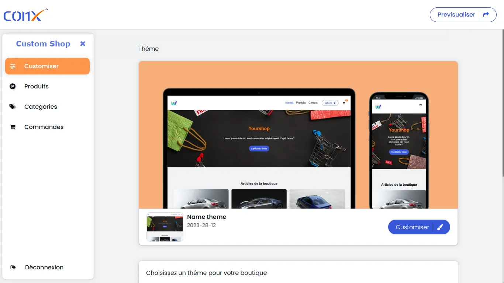

# Nom de l'application

Comx-front est une application web qui permet à un utilisateur de créer sa propre boutique en ligne facilement et rapidement. Avec cette application, vous pouvez créer une boutique en ligne pour vendre vos produits en quelques minutes, sans avoir besoin de compétences techniques.

## Fonctionnalités

- Créer une boutique en ligne personnalisée
- Ajouter des produits, des images, des descriptions, des prix, etc.
- Gérer les commandes et les clients
- Personnaliser le design de la boutique avec des thèmes prédéfinis

## Prérequis

- Node.js et npm installés sur votre machine

## Installation

1. Clonez ce dépôt de code sur votre machine
2. Ouvrez un terminal dans le dossier du projet et exécutez la commande `npm install` pour installer les dépendances
3. Exécutez la commande `npm run dev` pour lancer l'application en mode développement
4. Ouvrez votre navigateur à l'adresse http://localhost:3000 pour voir l'application en action

## Captures d'écran

## Scripts

Les scripts suivants sont disponibles dans ce projet :

- `dev`: Lance l'application en mode développement avec Vite.
- `build`: Compile le code TypeScript et construit l'application pour la production.
- `lint`: Exécute ESLint pour détecter et corriger les erreurs dans le code TypeScript.
- `preview`: Lance une version de prévisualisation de l'application en utilisant Vite.

Pour exécuter un script, ouvrez un terminal et tapez `npm run nom-du-script`, par exemple :

- `npm run dev` ou `yarn dev` Cela lancera l'application en mode développement avec Vite.

## Contribuer

Les contributions sont les bienvenues! Si vous souhaitez contribuer à l'application, veuillez suivre les étapes suivantes :

1. Créez une branche pour votre contribution : `git checkout -b ma-contribution`
2. Faites vos modifications et testez-les localement
3. Faites un commit de vos modifications : `git commit -am 'Ajout de ma contribution'`
4. Poussez vos modifications vers votre branche : `git push origin ma-contribution`
5. Ouvrez une demande de fusion (pull request) pour que vos modifications soient examinées et fusionnées dans le code principal

## Licence

Ce projet est sous licence MIT. Veuillez consulter le fichier LICENCE pour plus d'informations.
